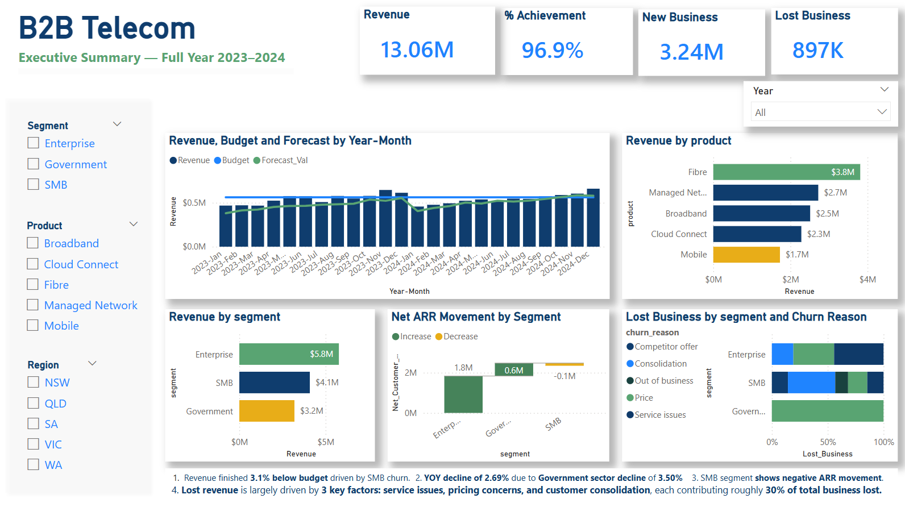
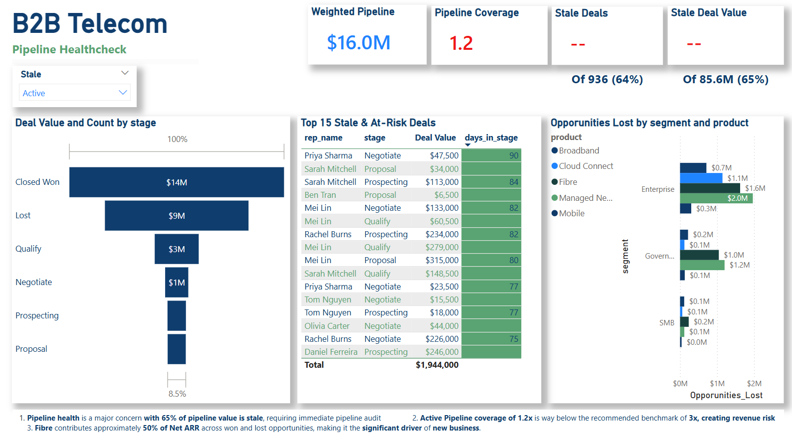
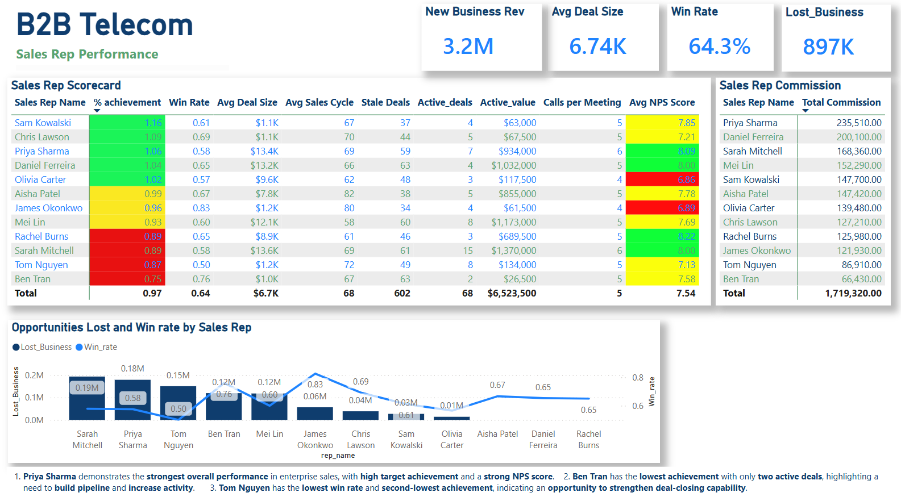
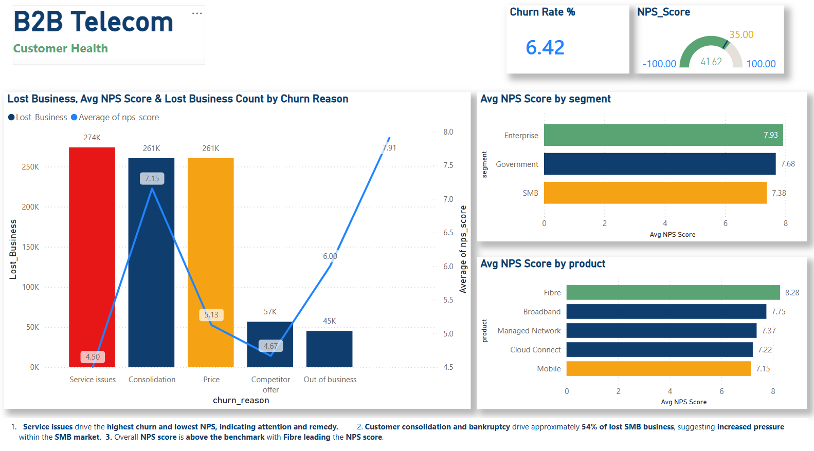
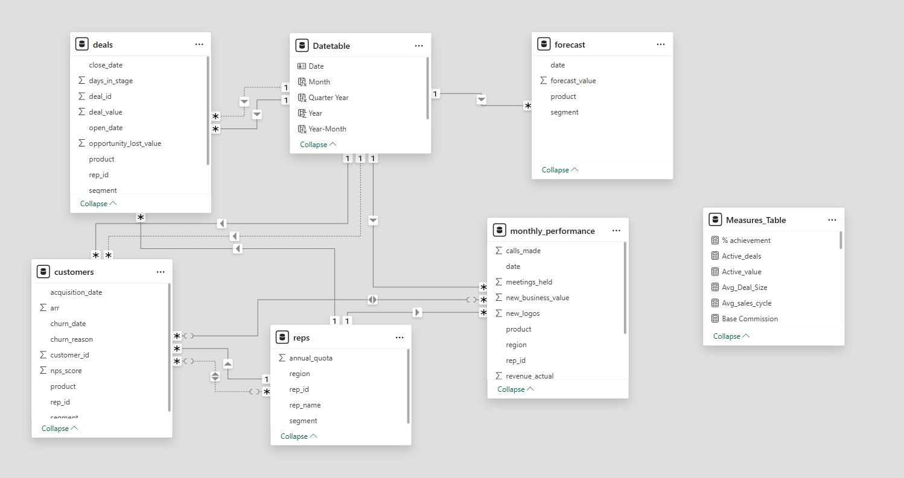

# B2B Telecom — Sales Operations Analysis

An end-to-end Sales Operations Report built in Power BI, simulating a national B2B telecom business across Enterprise, SMB and Government segments.



---

## Project Summary

| Metric | Value |
|---|---|
| Total Revenue Analysed | $13.06M |
| Pipeline Value | $83.6M across 936 deals |
| Customers | 185 accounts |
| Time Period | Jan 2023 – Dec 2024 |
| Segments | Enterprise, SMB, Government |
| Products | Fibre, Broadband, Mobile, Managed Network, Cloud Connect |

---

## Business Problem

A B2B telecom sales organisation needed visibility across four critical areas that were previously tracked in disconnected spreadsheets:

- Are reps hitting quota, and what's driving the gap?
- Is there enough pipeline to cover next quarter's target?
- Which customers are at risk of churning and why?
- How does actual revenue track against forecast and budget?

This report consolidates all four into a single Power BI solution.
---

## Dashboard Pages

### 1. Executive Summary
Revenue vs budget vs forecast by month, segment and product breakdown, net ARR movement and churn analysis by reason.


### 2. Pipeline Health
Weighted pipeline, pipeline coverage ratio, deal funnel by stage, and stale deal identification with conditional formatting.



### 3. Sales Rep Performance
Full rep performance matrix — quota attainment, win rate, avg deal size, sales cycle, activity metrics, commission calculation and NPS attribution.



### 4. Customer Health
NPS score by segment and product, churn analysis by reason.



---

## Data Model

Star schema built in Power BI with 5 fact/dimension tables 
and a custom Date table.



| Table | Rows | Description |
|---|---|---|
| monthly_performance | 1,440 | Revenue actuals and targets by rep × product × month |
| deals | 936 | Full pipeline with stage, value and sales cycle |
| customers | 185 | ARR, churn date, NPS and churn reason |
| forecast | 360 | Top-down leadership forecast by segment × product × month |
| reps | 12 | Rep dimension with quota and region |

---

## Key DAX Measures
```dax
-- Stale Deals
Stale_Deals = CALCULATE(COUNTROWS(deals),
              deals[stage] <> "Closed Won",
              deals[stage] <> "Lost",
              deals[days_in_stage] > 90
                        )

-- Sales Rep Commission
Commission Rate = SWITCH(TRUE(),
                  [% achievement]<0.8,0.08,
                  [% achievement]<1,0.10,
                  [% achievement]<1.2,0.14,
                  0.18)

Base Commission = SUMX(monthly_performance, monthly_performance[revenue_actual]*[Commission Rate])
Total Commission = [Base Commission] + SUM(monthly_performance[spif_bonus])

-- Weighted Pipeline (probability-adjusted)
Weighted Pipeline = SUMX(deals,
                    deals[deal_value] *
                    SWITCH(deals[stage],
                    "Prospecting", 0.10,
                    "Qualify", 0.25,
                    "Proposal", 0.50,
                    "Negotiate", 0.75,
                    "Closed Won", 1.00,
                    0)
                    )

-- Pipeline Coverage
Pipeline Coverage = DIVIDE([Weighted Pipeline], SUM(monthly_performance[revenue_target]))

-- NPS Score - Promoters, detractors, Passives

Promoters = CALCULATE(COUNTROWS(customers),customers[nps_score]>=8)
Detractors = CALCULATE(COUNTROWS(customers), customers[nps_score]<=5)
Passives = CALCULATE(COUNTROWS(customers),customers[nps_score] IN {6,7})

NPS_Score = DIVIDE(
            ([Promoters]-[Detractors]),
            ([Promoters]+[Detractors]+[Passives])
                )*100

-- Forecast Var 

Forecast Var % = DIVIDE([Revenue]-[Forecast_Val],[Forecast_Val])

```
---

## Key Insights

**Revenue and Product Performance**
•	Fibre products contribute approximately 50% of Net ARR, making it the most influential product category for overall revenue performance.
•	Enterprise sales show strong performance, led by high-achieving sales representatives.

**Pipeline Health**

•	A significant portion of opportunities are stale (over 90 days old), indicating potential pipeline inflation and reduced likelihood of conversion.
•	Pipeline progression and deal velocity require improvement to maintain sustainable revenue growth.

**Sales Rep Performance**

•	Priya Sharma delivered a strong enterprise sales performance with high achievement and strong customer satisfaction (NPS).
•	Ben Tran shows low achievement with limited active opportunities, indicating a need to strengthen pipeline generation.
•	Tom Nguyen records the lowest win rate and below-target achievement, suggesting opportunities to improve deal closing capability.

**Customer Experience and Churn**

•	Service issues, pricing pressure, and customer consolidation are key drivers of lost business.
•	In the SMB segment, 54% of lost business is driven by consolidation and bankruptcy, highlighting structural challenges within this market.

---

## Key Risks

•	High proportion of stale pipeline opportunities, reducing forecast reliability.
•	Customer service issues, impacting NPS and retention.
•	SMB segment vulnerability due to financial instability among customers.
•	Performance variability among sales representatives is affecting overall productivity.

---

## Strategic Recommendations

1.	Improve pipeline hygiene by reviewing opportunities older than 90 days and enforcing regular pipeline reviews.
2.	Increase prospecting activity and pipeline development for underperforming sales representatives.
3.	Provide targeted training to improve deal closing effectiveness and win rates.
4.	Enhance service quality and support responsiveness to improve NPS and reduce churn.
5.	Prioritise Fibre product sales, as improvements in this category can significantly impact overall revenue growth.
6.	Implement early risk monitoring for SMB customers to reduce revenue loss from consolidation and bankruptcy.

---

## Tools & Skills

- **Power BI Desktop** — data modelling, DAX, report design
- **Data Modelling** — star schema, inactive relationships
- **DAX** — time intelligence, CALCULATE, SUMX, iterators
  **Visualisation** - Line & Clustered column chart, Funnel, Waterfall chart, Matrix
---
